Name: Sarah Hassaballa

This repo is a clone of 
https://github.com/miguelgrinberg/flasky.

### Activity 1.1: 
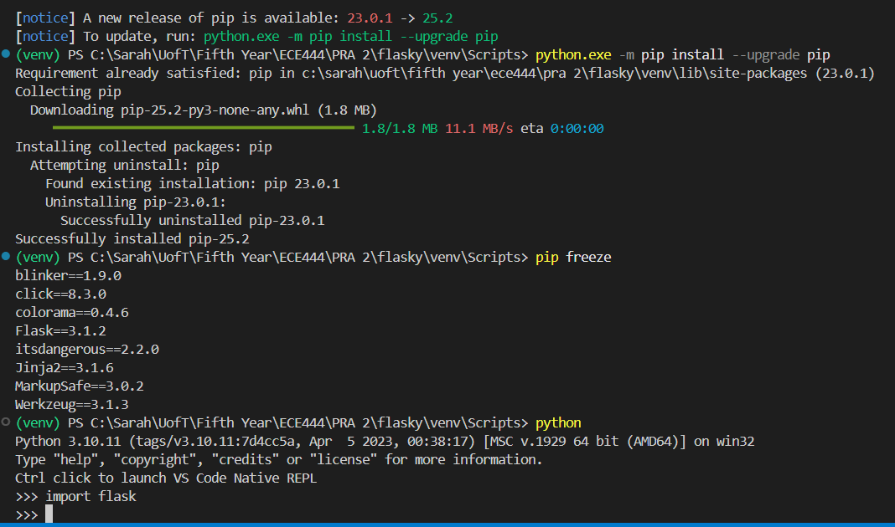

### Activity 1.2:
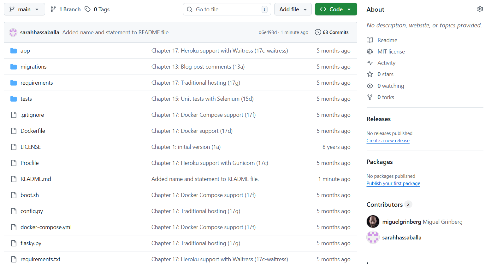
### Activity 1.2 Example 2-1:
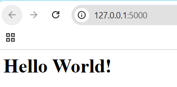
### Activity 1.2 Example 2-2:

### Activity 1.3:
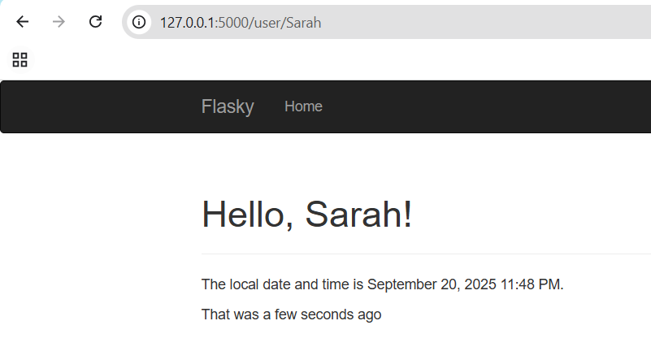

### Activity 1.4 Part 1:

### Activity 1.4 Part 2:
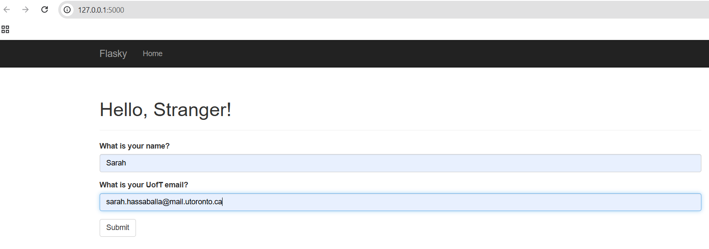
### Activity 1.4 Part 3:
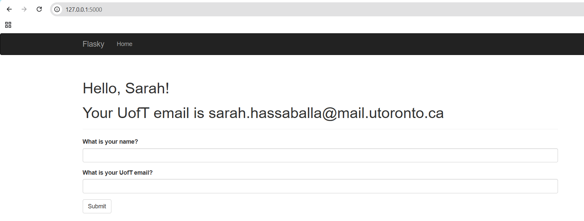
### Activity 1.4 Part 4:
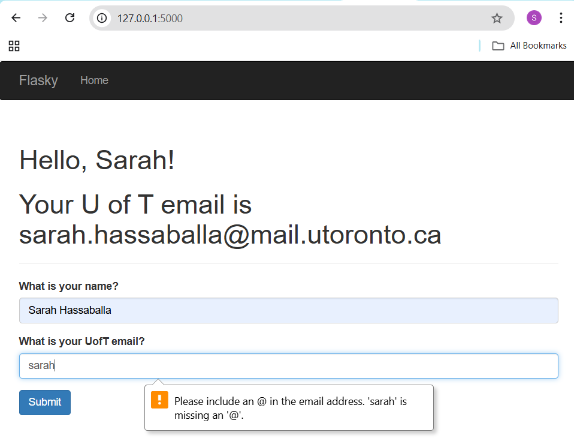
### Activity 1.4 Part 5:
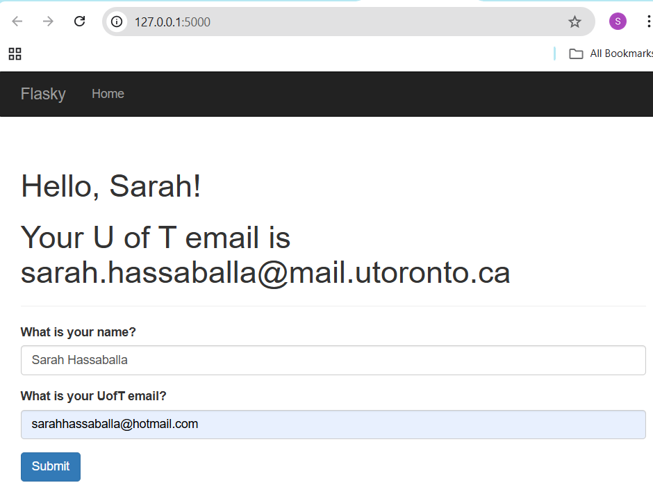
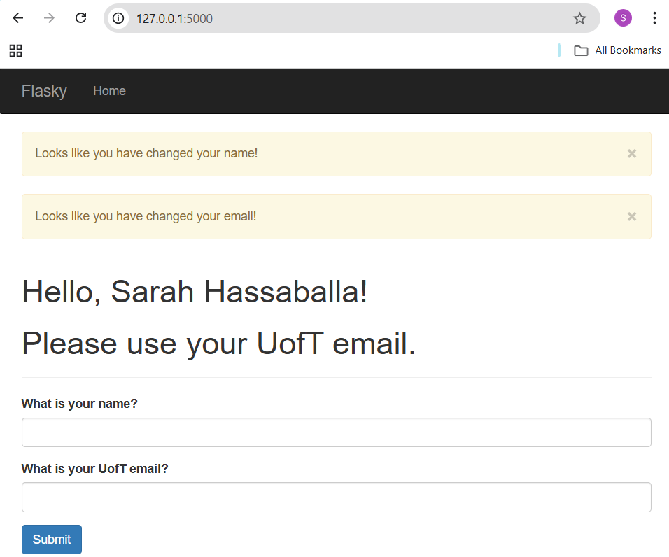

### Activity 2.1:
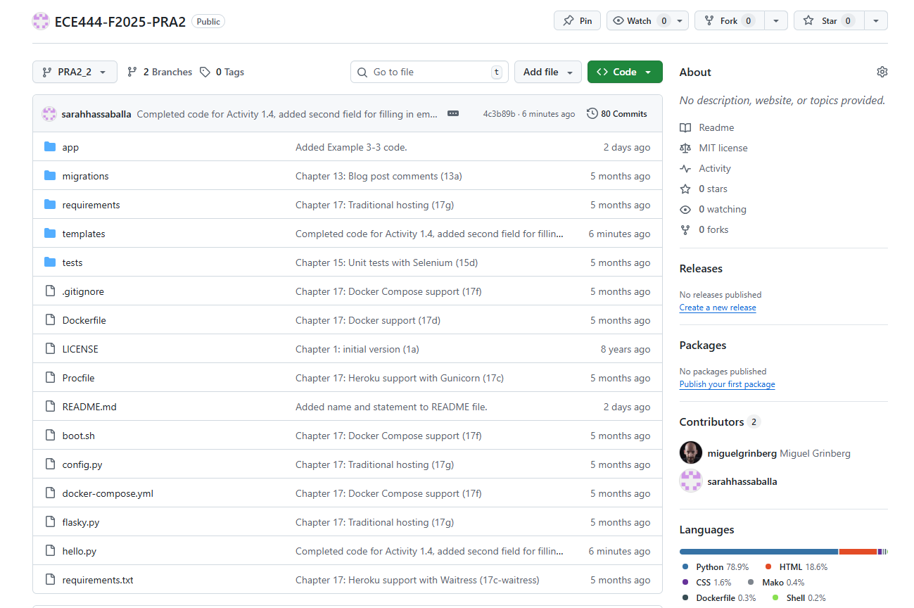
### Activity 2.2:
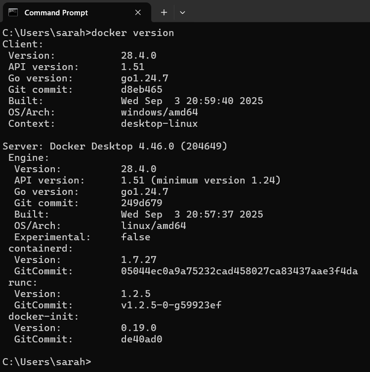
### Activity 2.3:

### Activity 2.4 Part 1:
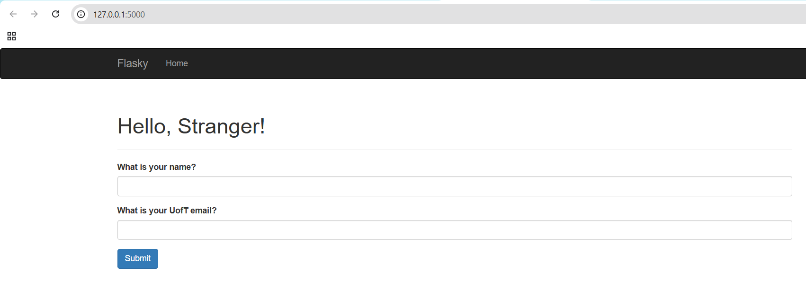
### Activity 2.4 Part 2:
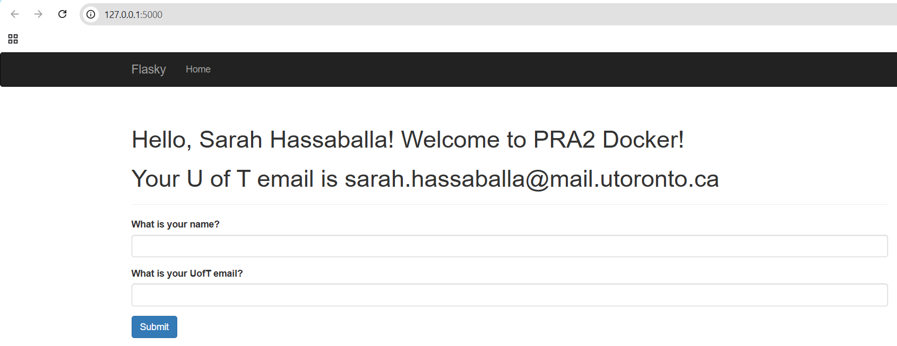
### Activity 2.4 Part 3:
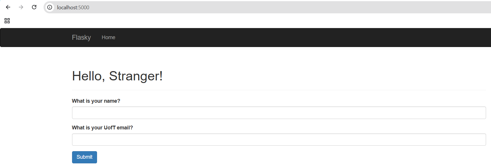
### Activity 2.4 Part 4:
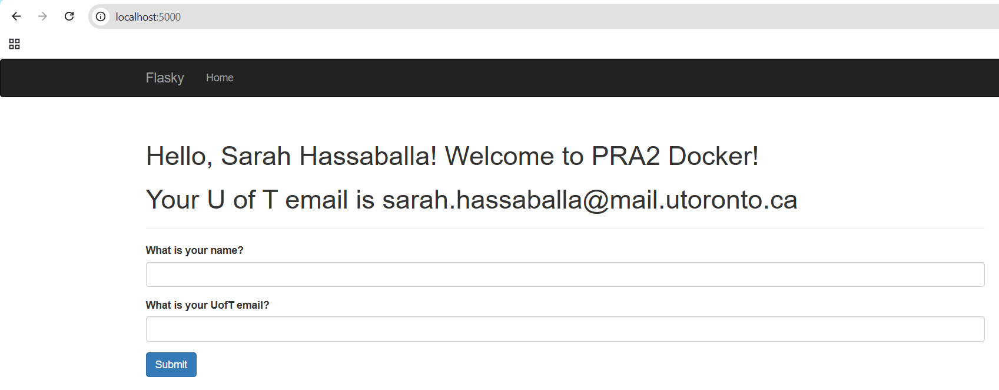
### Activity 2.4 Part 5:
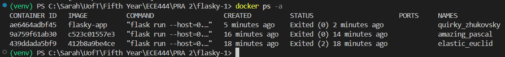
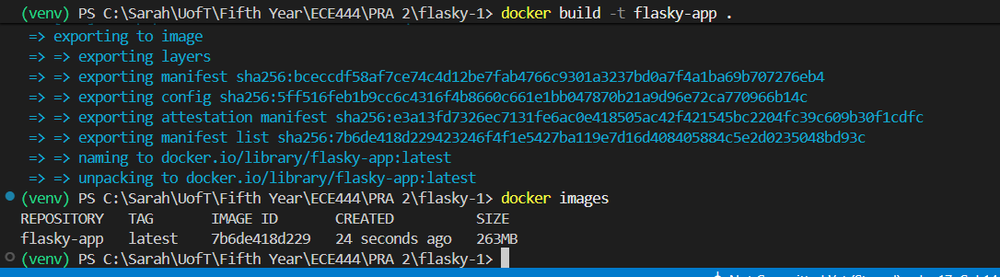