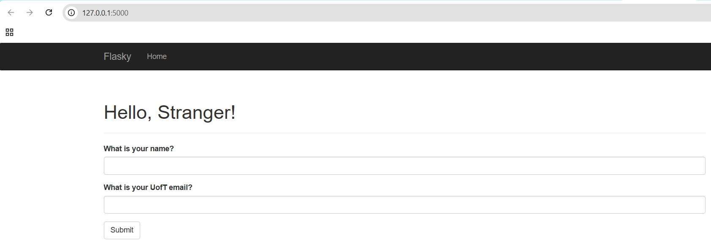

Name: Sarah Hassaballa

This repo is a clone of 
https://github.com/miguelgrinberg/flasky.

### Activity 1.1: 

### Activity 1.2:

### Activity 1.2 Example 2-1:

### Activity 1.2 Example 2-2:

### Activity 1.3:

### Activity 1.4 Part 1:

### Activity 1.4 Part 2:

### Activity 1.4 Part 3:

### Activity 1.4 Part 4:

### Activity 1.4 Part 5:

### Activity 1.4 Part 6:

### Activity 2.1:

### Activity 2.2:

### Activity 2.3:

### Activity 2.4 Part 1:

### Activity 2.4 Part 2:

### Activity 2.4 Part 3:

### Activity 2.4 Part 4:

### Activity 2.4 Part 5:

Flasky
======

This repository contains the source code examples for the second edition of my O'Reilly book [Flask Web Development](http://www.flaskbook.com).

The commits and tags in this repository were carefully created to match the sequence in which concepts are presented in the book. Please read the section titled "How to Work with the Example Code" in the book's preface for instructions.

For Readers of the First Edition of the Book
--------------------------------------------

The code examples for the first edition of the book were moved to a different repository: [https://github.com/miguelgrinberg/flasky-first-edition](https://github.com/miguelgrinberg/flasky-first-edition).
